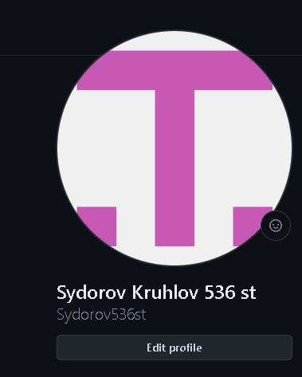
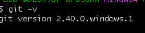
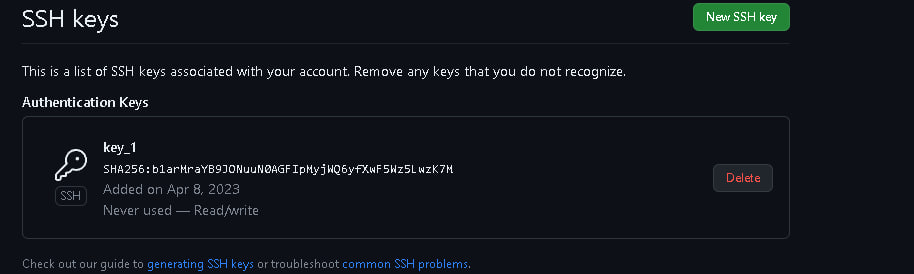
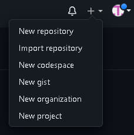
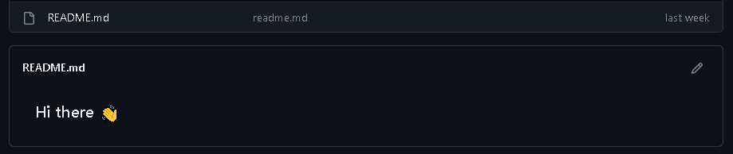
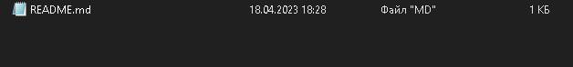
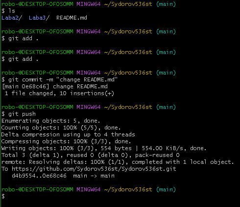
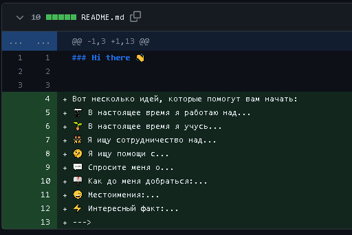
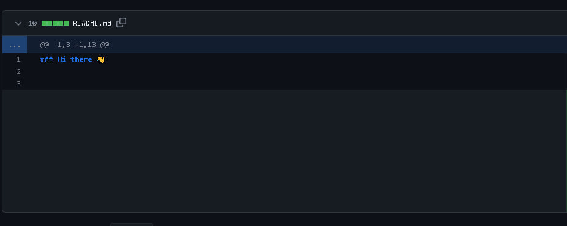

Лабораторна робота №1

Сидоров Я.Д. Круглов А.Ю. 536ст група


**Мета роботи:** зарееструватися на Github та навчитися користуватися базовими командами у Git Bash

**Виконання завдання:**


1. Спочатку створюємо аккаунт на Github:




Рисунок 1.1

1. Далі встановлюємо CHOCOLATEY за допомогою Powershell:

Для цього використовуємо у powershell команду: 
```
Set-ExecutionPolicy Bypass -Scope Process -Force; [System.Net.ServicePointManager]::SecurityProtocol = [System.Net.ServicePointManager]::SecurityProtocol -bor 3072; iex ((New-Object System.Net.WebClient).DownloadString('https://chocolatey.org/install.ps1'))
```
1. Встановлюємо гіт та перевіряємо.



Рисунок 1.2 – Версія GitHub

1. Налаштовуємо гіт у Git Bash вказавши ім'я та адресу електронної пошти. Для цього використаємо команди:
```
git config --global user.name "Sydorov Kruhlov 536 st"
```
```
git config --global user.email y.d.sydorov@student.khai.edu
```
1. Згенеруємо новий SSH ключ, використаємо команду:
```
ssh-keygen -t ed25519 -C " y.d.sydorov@student.khai.edu "
```
В результаті отримали файл с публічним та приватним ключем.

1. Додамо ключ до облікового запису Github:




Рисунок 1.3– ключ до облікового запису


1. Створимо новий репозиторій та налаштовуємо опис:




Рисунок 1.4



Рисунок 1.5– Новий репозиторій

1. Завантажимо репозиторій на компьютер за допомогою ssh, використаємо команду:

![}(photo6.jpg)

Рисунок 1.6 - ssh ключ

git clone < git@github.com:Sydorov536st/Sydorov536st.git>



Рисунок 1.7 – Файл на ПК


1. Відредагуємо Readme.md файл та відправимо його на github: Команди на рисунку 1.8, результат на рисунку 1.9 та 1.10:




Рисунок 1.8



Рисунок 1.9



Рисунок 1.10

`	`Тобто, спочатку переходимо у нашу папку, питаємо Git що в цій папці, далі вказуємо Git-у слідкувати за файлом, робимо нову версію нашого файлу та завантажуємо змінений файл у GitHub. 


Висновки


`      ` В ході виконання роботи ознайомилися з платформою гітхаб, для чого було створено новий аккаунт,
налаштовано та відредаговано його.


