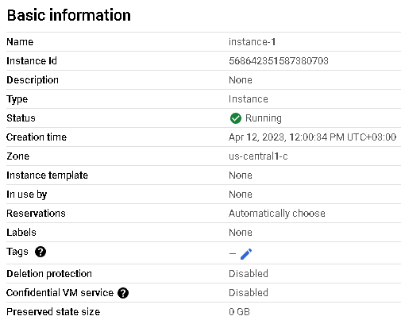
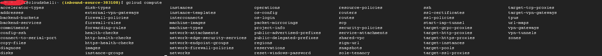
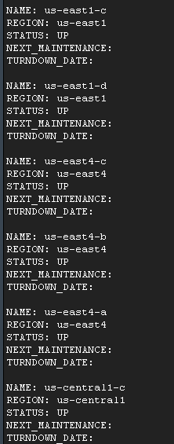
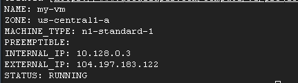
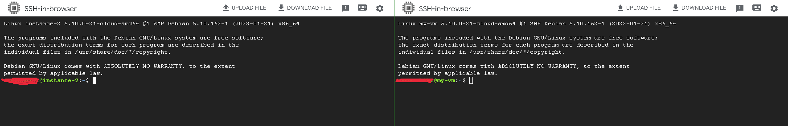
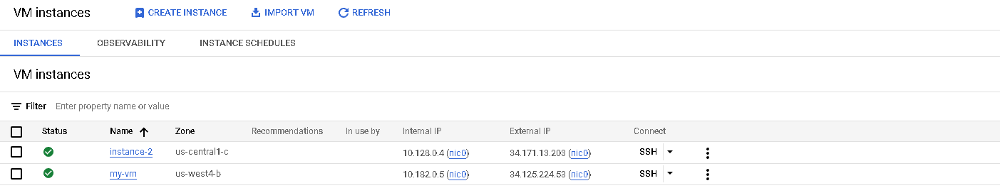

Лабораторна робота №2

Сидоров Я.Д. Круглов А.Ю. 536ст група		
	
**Мета роботи:** Ознайомитись із сервісом Гугл Клауд Платформ.

**Виконання роботи:**

1. Спочатку реєструємося на Googl Cloud.

1.Далі створюємо проект.

1. Характеристики машини:

Рисунок 1.1 - Характеристики віртуальної машини

1. Далі створюємо віртуальну машину за допомогою консолі.

Для цього у вбудовану консоль впишемо gcloud compute,та натиснемо два рази "Tab", щоб побачити перелік команд.

Рисунок 1.2

`       ` Пропишемо gcloud compute zones list.

Рисунок 1.3 - зони 

`       ` їх дуже багато, ось обрана:

Рисунок 1.4 - обрана зона

Після того як обрали усі параметри , створюємо віртуальну машину. Далі на двух рисунках буде зображено дві машини створені двома способами,рисонок 1.5-1.6:

Рисунок 1.5

Рисунок 1.6

Висновки: 

'       'В ході виконання роботи ознайомились з функціоналом гугл клауду, для чого двома способами було створено по віртуальній машині.
За результатами виконання можна казати, що дана середа є наочною та відносно простою для використання, що робить її незамінною для даного роду задач.

