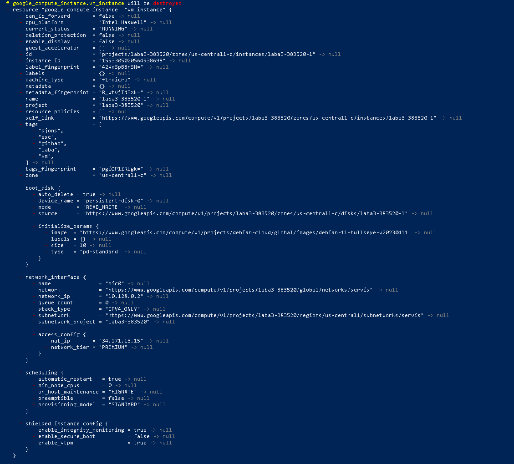

Лабораторна робота №3

Сидоров Я.Д. Круглов А.Ю. 536ст група

**Мета:** Ознайомитись з функціоналом інструмента терраформ

1.Встановлюємо Terraform 

пишемо команду **Choco install terraform,** потім перевіремо яка версія та чи нема проблем з встановлюванням.


2.Створюємо проект GCP


3. Далі налаштовуємо **Terraform.** Створюємо три файли типу **(main, variables, outputs).tf**
в яких буде записан певний код. У **main** вказується **Terraform,** що працюватиме із GCP,створюється **networ** та **subnetwork**, 
у **vm\_instance* задаємо 5 тегів.Конфігуруємо **firewall.** в **variables** вказуємо Project ID:назву та назву файлу з ключем.

**main.tf**
```
terraform {
	required\_providers {
	 google = {
	 source = "hashicorp/google"
	 version = "4.51.0"
		}
	}
}
provider "google" {
	credentials = file(var.credentials\_file)
	project = var.project
	region  = var.region
	zone    = var.zone
}
resource "google\_compute\_network" "vpc\_network" {
	name = "servis"
	}
resource "google\_compute\_subnetwork" "Labsubnet" {
	name = var.subnet\_name
	network = google\_compute\_network.vpc\_network.self\_link
	ip\_cidr\_range = "10.2.0.0/16"
	region= var.region
}
resource "google\_compute\_instance" "vm\_instance" {
	name = var.machine\_name
	machine\_type = "f1-micro"
	tags = ["djons", "esc", "githab", "laba", "matrics"]
	boot\_disk {
		initialize\_params {
			image = "debian-cloud/debian-11"
		}
	}
	network\_interface {
		network = google\_compute\_network.vpc\_network.name
		access\_config {
		}
	}
}
resource "google\_compute\_firewall" "vpc-network-allow" {
	name    = "letmein"
	network = google\_compute\_network.vpc\_network.self\_link
	allow {
		protocol = "tcp"
		ports    = ["80", "8080", "1000-2000"]
	}
	target\_tags = ["http-server","https-server"]
	source\_tags = ["vpc-network-allow"]
```
**variables.tf:**
```
variable "project" {
    default = "laba3-383520"
}
variable "credentials_file" {
    default = "laba3-383520-367b73a2aa53.json"
}
variable "region" {
    default = "us-central1"
}
variable "zone" {
    default = "us-central1-c"
}
variable "machine_name" {
    default = "laba3-383520-1"
}
variable "subnet_name" {
  default = "laba3-383520-subnet-1"
}
```
**outputs.tf:**
```
output "ip_intra" {
  value = google_compute_instance.vm_instance.network_interface.0.network_ip
}
output "ip_extra" {
  value=google_compute_instance.vm_instance.network_interface.0.access_config.0.nat_ip
}
```
4.Далі повертаємось у PowerShell та прописуємо наступну команду **terraform init,** після чого ще одну **terraform apply**,
щоб отримати список наступних дій **Terraform**.


Як бачимо похибок нема,тобто все виконано вірно.
Перейдемо до Google cloud, до проекту:


Далі видалимо ВМ:





Все видалено , тобіж все працує коректно.


