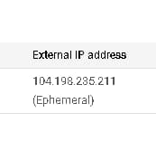
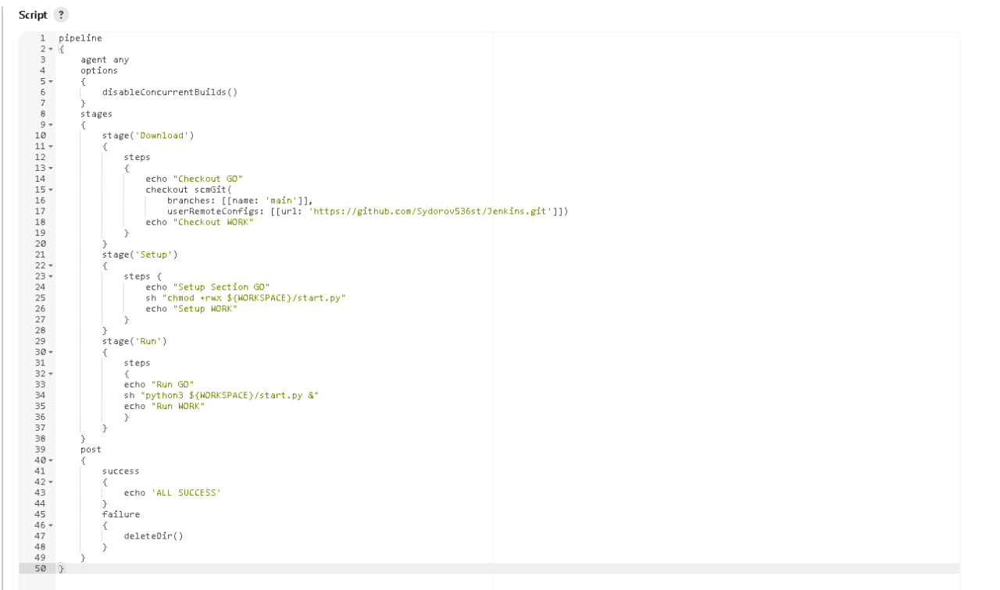
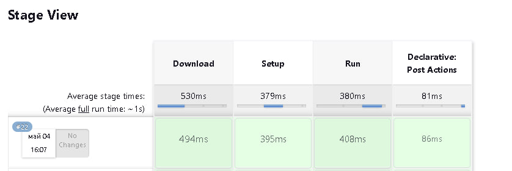
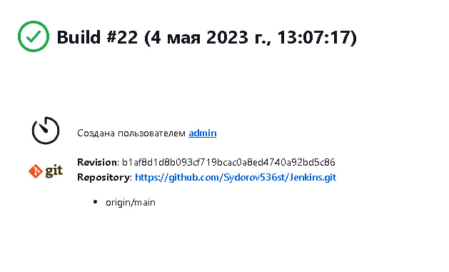
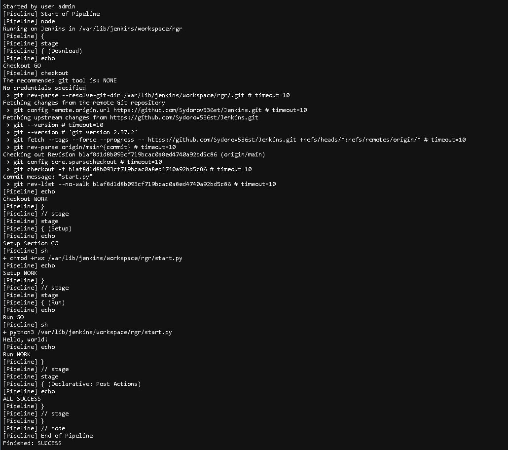

# Розрахунково-графічна робота
## розгортка скрипту Пайтон за допомогою Дженкінс

**Завдання:**

Автомаитзувати:
1. Створення віртуальної машини з операційною системою Linux
2. Розгортування інструмента для CI/CD
3. Пайплайн для CI/CD
Рекомендовані інструменти:
1. GCP, AWS, Azure
2. Jenkins, GitHub CI, GitLab CI, Azure DevOps
3. Terraform, Ansible, Chef

**Виконання:**
1. У Павершел створюємо віртуальну машину за допомогою Терраформ:

main.tf:
```
terraform {
  required_providers {
    google = {
      source  = "hashicorp/google"
      version = "4.51.0"
    }
  }
}

provider "google" {
  credentials = file(var.credentials_file)

  project = var.project
  region  = var.region
  zone    = var.zone
}

resource "google_compute_network" "vpc_network" {
  name = "rgr"
}

resource "google_compute_instance" "vm_instance" {
  name         = var.machine_name
  machine_type = "e2-standard-2"
  tags         = ["rgr", "jenkins"]

  boot_disk {
    initialize_params {
      image = "ubuntu-os-cloud/ubuntu-minimal-2210-kinetic-amd64-v20230425"
    }
  }

  network_interface {
    network = google_compute_network.vpc_network.name
    access_config {
    }
  }
}

resource "google_compute_firewall" "rules" {
  project       = var.project
  name          = "rgr"
  network       = "rgr"
  description   = "Creates firewall rule targeting tagged instances"
  source_ranges = ["0.0.0.0/0"]

  allow {
    protocol = "tcp"
    ports    = ["20", "22", "80", "8080", "7777", "1000-2000"]
  }

  source_tags = ["vpc"]
  target_tags = ["rgr", "jenkins"]
}
```

variables.tf
```
variable "project" {
  default = "laba3-383520"
}

variable "credentials_file" {
  default = "laba3-383520-367b73a2aa53.json"
}

variable "region" {
  default = "us-central1"
}

variable "zone" {
  default = "us-central1-c"
}

variable "machine_name" {
  default = "rgr"
}
```

2. Встановлюємо та налаштовуємо Дженкінс.
Просписуємо:
```
sudo apt update
```
 – оновлення бази даних пакетів 
```
sudo apt install nano
```
 – встановлення текстового редактору
```
sudo apt install git
```
 – встановити гіт
```
sudo apt install openjdk-11-jre
```
 – встановлення Джава
```
curl -fsSL https://pkg.jenkins.io/debian/jenkins.io-2023.key | sudo tee \
  /usr/share/keyrings/jenkins-keyring.asc > /dev/null

echo deb [signed-by=/usr/share/keyrings/jenkins-keyring.asc] \
  https://pkg.jenkins.io/debian binary/ | sudo tee \
  /etc/apt/sources.list.d/jenkins.list > /dev/null
```

```
sudo apt-get update
```

```
sudo apt-get install jenkins 
```
– встановлюємо сам Дженкінс

```
sudo cat /var/lib/jenkins/secrets/initialAdminPassword 
```
– Створюємо пароль для входу на айпі нашої ВМ 


`    `Також додаємо до цього айпі порт 8080, для можливості переходу.


`   ` cd /etc
sudo nano sudoers – щоб відкрити файл, де даємо Дженкінсу усі права доступу.


3. Автоматизуємо CI/CD
Створюємо пайплайн у Дженкінс та конектимо з гітхабом.

**Скрипт:**





4. Перевіряємо працездатність
Всановлюємо Пайтон для запускання необхідного скрипту за допопомогою sudo apt-get install python3
Тепер пробуємо запустити файл з розширенням .py і на наступних скріншотах дивимося результат.







`    ` Як бачимо з Консол Аутпут, скрипт працює та виводить Hello,world!.
Меню Консол Аутпут:





`      ` Висновки: В ході виконання роботи було віртуальну машину, після чого встановлено Дженкінс, Джава та Пайтон.
 За допомогою всіх цих інструментів була написана певна система, що за мінімумом ручної роботи запускає на віртуальній машині скрипт.
 Так, скрипт, що було запущено, є елементарним, але дана система справиться з більш великим навантаженням, виходяи з можливостей обраної ВМ (в даному випадку - e2-standard-2).


